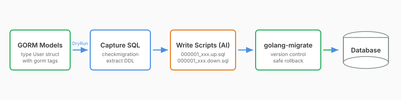
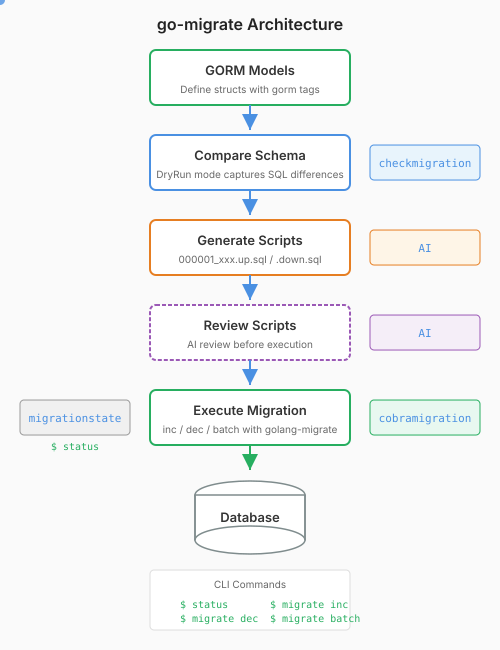

[](https://github.com/yylego/go-migrate/actions/workflows/release.yml?query=branch%3Amain)
[](https://pkg.go.dev/github.com/yylego/go-migrate)
[](https://coveralls.io/github/yylego/go-migrate?branch=main)
[](https://go.dev/)
[](https://github.com/yylego/go-migrate/releases)
[](https://goreportcard.com/report/github.com/yylego/go-migrate)

# go-migrate

Database migration toolkit with GORM schema analysis, migration execution and status management.

---

## Ecosystem





<!-- TEMPLATE (EN) BEGIN: LANGUAGE NAVIGATION -->

## CHINESE README

[中文说明](README.zh.md)

<!-- TEMPLATE (EN) END: LANGUAGE NAVIGATION -->

## Features

- **Smart Schema Analysis**: Auto-compare GORM models with existing database schemas
- **Multi-Database Support**: Works with MySQL, PostgreSQL, SQLite through golang-migrate
- **Comprehensive CLI**: Intuitive Cobra commands with complete migration support
- **Status Inspection**: Check database version, pending migrations and schema differences

## Core Packages

| Package          | Purpose                                                    |
| ---------------- | ---------------------------------------------------------- |
| `checkmigration` | Compare GORM models with database, capture SQL differences |
| `newmigrate`     | Create golang-migrate instance                             |
| `migrationparam` | Migration connection management and debug mode settings    |
| `cobramigration` | Cobra CLI commands (inc/dec/all)                           |
| `migrationstate` | Check migration status                                     |

## Installation

```bash
go get github.com/yylego/go-migrate
```

## Quick Start

### 1. Define GORM Models

```go
type User struct {
    ID   uint   `gorm:"primarykey"`
    Name string `gorm:"size:100"`
    Age  int
}
```

### 2. Setup CLI Program

```go
package main

import (
    "github.com/yylego/go-migrate/cobramigration"
    "github.com/yylego/go-migrate/migrationparam"
    "github.com/yylego/go-migrate/migrationstate"
    "github.com/yylego/go-migrate/newmigrate"
    "github.com/golang-migrate/migrate/v4"
    mysqlmigrate "github.com/golang-migrate/migrate/v4/database/mysql"
    "github.com/spf13/cobra"
    "github.com/yylego/must"
    "github.com/yylego/rese"
    "gorm.io/gorm"
)

func main() {
    scriptsPath := "./scripts"

    // MigrationParam with on-demand initialization and unified resource management
    param := migrationparam.NewMigrationParam(
        func() *gorm.DB {
            return setupDatabase() // GORM setup goes here
        },
        func(db *gorm.DB) *migrate.Migrate {
            sqlDB := rese.P1(db.DB())
            driver := rese.V1(mysqlmigrate.WithInstance(sqlDB, &mysqlmigrate.Config{}))
            return rese.P1(newmigrate.NewWithScriptsAndDatabase(&newmigrate.ScriptsAndDatabaseParam{
                ScriptsInRoot:    scriptsPath,
                DatabaseName:     "mysql",
                DatabaseInstance: driver,
            }))
        },
    )

    objects := []any{
        &User{},
        &Product{},
        &Cart{},
    }

    rootCmd := &cobra.Command{Use: "app"}
    rootCmd.AddCommand(cobramigration.NewMigrateCmd(param))
    rootCmd.AddCommand(migrationstate.NewStatusCmd(&migrationstate.Config{
        Param:       param,
        ScriptsPath: scriptsPath,
        Objects:     objects,
    }))

    must.Done(rootCmd.Execute())
}
```

### 3. Common Workflow

```bash
# Step 1: Check current status
go run main.go status

# Step 2: Write migration scripts (hand-written / AI-generated)
# e.g., scripts/000001_xxx.up.sql and scripts/000001_xxx.down.sql

# Step 3: Execute migration
go run main.go migrate inc    # One step
go run main.go migrate all    # batch run
```

## AI-Driven Script Authoring

Previous versions included built-in script generation (`newscripts`) and migration preview (`previewmigrate`) packages. These have been removed:

- **AI produces more accurate scripts**: AI assistants (e.g., Claude Code) can read GORM struct changes and produce precise migration SQL without a database connection.
- **AI prefers hand-writing**: Even when docs emphasize using the package, AI assistants notice existing `migrations` files, then guess the pattern and hand-write new ones — bypassing the package. Hand-written results are consistent and accurate, while package output is hit-and-miss; mixed usage causes inconsistencies, so dropping the generation feature (keeping just validation) was the cleanest choice.
- **No database needed to create scripts**: The old approach required a running database to capture schema differences via GORM DryRun mode. AI produces scripts just from reading code.
- **Preview had limitations**: MySQL does not support DDL transaction rollback, making the preview feature unreliable on the most common database engine.
- **AI assists with errors**: Preview existed to avoid stepping through fixes once a mid-migration failure occurs. Now when errors arise, AI can guide a swift rollback to the previous state. Since migrations often run on test environments first, since failures are uncommon, and since AI handles them fine, the preview step has become redundant.

The updated architecture focuses on what AI cannot replace: **schema validation, migration execution, and status management**. Script authoring is delegated to AI / hand-written approaches.

## CLI Command List

| Command       | Description                                            |
| ------------- | ------------------------------------------------------ |
| `status`      | Show database version, pending migrations, schema diff |
| `migrate`     | Show current migration version                         |
| `migrate inc` | Execute next migration                                 |
| `migrate dec` | Rollback one migration                                 |
| `migrate all` | Execute pending migrations at once                     |

## Database Support

Works with MySQL, PostgreSQL, SQLite through golang-migrate drivers:

```go
// MySQL
import mysqlmigrate "github.com/golang-migrate/migrate/v4/database/mysql"
driver := rese.V1(mysqlmigrate.WithInstance(sqlDB, &mysqlmigrate.Config{}))

// PostgreSQL
import postgresmigrate "github.com/golang-migrate/migrate/v4/database/postgres"
driver := rese.V1(postgresmigrate.WithInstance(sqlDB, &postgresmigrate.Config{}))

// SQLite
import sqlite3migrate "github.com/golang-migrate/migrate/v4/database/sqlite3"
driver := rese.V1(sqlite3migrate.WithInstance(sqlDB, &sqlite3migrate.Config{}))
```

## Advanced Configuration

### Debug Mode

Enable debug mode to see detailed SQL capture and migration analysis output:

```go
import "github.com/yylego/go-migrate/migrationparam"

// Enable debug mode to see migration details
migrationparam.SetDebugMode(true)

// Check current debug mode status
if migrationparam.GetDebugMode() {
    // Debug logging is enabled
}
```

### Embedded Migrations

```go
//go:embed migrations
var migrationsFS embed.FS

migration := rese.V1(newmigrate.NewWithEmbedFsAndDatabase(&newmigrate.EmbedFsAndDatabaseParam{
    MigrationsFS:     &migrationsFS,
    EmbedDirName:     "migrations",
    DatabaseName:     "mysql",
    DatabaseInstance: driver,
}))
```

## Examples

See [internal/demos/](internal/demos) with complete working examples:

- [demo1x](internal/demos/demo1x): MySQL integration with Makefile commands
- [demo2x](internal/demos/demo2x): PostgreSQL integration with Makefile commands

```bash
cd internal/demos/demo1x
make STATUS       # Check status
make MIGRATE-INC  # Execute next
make MIGRATE-ALL  # batch run
```

<!-- TEMPLATE (EN) BEGIN: STANDARD PROJECT FOOTER -->
<!-- VERSION 2025-11-25 03:52:28.131064 +0000 UTC -->

## 📄 License

MIT License - see [LICENSE](LICENSE).

---

## 💬 Contact & Feedback

Contributions are welcome! Report bugs, suggest features, and contribute code:

- 🐛 **Mistake reports?** Open an issue on GitHub with reproduction steps
- 💡 **Fresh ideas?** Create an issue to discuss
- 📖 **Documentation confusing?** Report it so we can improve
- 🚀 **Need new features?** Share the use cases to help us understand requirements
- ⚡ **Performance issue?** Help us optimize through reporting slow operations
- 🔧 **Configuration problem?** Ask questions about complex setups
- 📢 **Follow project progress?** Watch the repo to get new releases and features
- 🌟 **Success stories?** Share how this package improved the workflow
- 💬 **Feedback?** We welcome suggestions and comments

---

## 🔧 Development

New code contributions, follow this process:

1. **Fork**: Fork the repo on GitHub (using the webpage UI).
2. **Clone**: Clone the forked project (`git clone https://github.com/yourname/repo-name.git`).
3. **Navigate**: Navigate to the cloned project (`cd repo-name`)
4. **Branch**: Create a feature branch (`git checkout -b feature/xxx`).
5. **Code**: Implement the changes with comprehensive tests
6. **Testing**: (Golang project) Ensure tests pass (`go test ./...`) and follow Go code style conventions
7. **Documentation**: Update documentation to support client-facing changes
8. **Stage**: Stage changes (`git add .`)
9. **Commit**: Commit changes (`git commit -m "Add feature xxx"`) ensuring backward compatible code
10. **Push**: Push to the branch (`git push origin feature/xxx`).
11. **PR**: Open a merge request on GitHub (on the GitHub webpage) with detailed description.

Please ensure tests pass and include relevant documentation updates.

---

## 🌟 Support

Welcome to contribute to this project via submitting merge requests and reporting issues.

**Project Support:**

- ⭐ **Give GitHub stars** if this project helps you
- 🤝 **Share with teammates** and (golang) programming friends
- 📝 **Write tech blogs** about development tools and workflows - we provide content writing support
- 🌟 **Join the ecosystem** - committed to supporting open source and the (golang) development scene

**Have Fun Coding with this package!** 🎉🎉🎉

<!-- TEMPLATE (EN) END: STANDARD PROJECT FOOTER -->

---

## GitHub Stars

[](https://starchart.cc/yylego/go-migrate)
